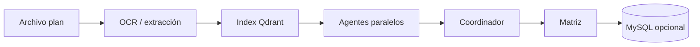

# Gestor de Responsabilidades — Backend

API **FastAPI** para análisis de planes de desarrollo territorial: extracción de texto (OCR), indexación **RAG** local (**Ollama** + **Qdrant**), consultas semánticas, pipeline **multi-agente** con coordinador y persistencia opcional en **MySQL**.

Todo el stack corre en Docker; no se requieren APIs de nube para el MVP.

---

## Capacidades

| Área | Descripción |
|------|-------------|
| **RAG** | Ingesta de texto o archivos (PDF, TXT, MD, imágenes), chunking fijo/adaptativo, búsqueda vectorial y respuestas con citas (`/rag/ask`). |
| **OCR** | PDF nativo + OCR híbrido (Tesseract/Poppler en la imagen API); extracción sin indexar (`/documents/extract*`). |
| **Análisis** | Un endpoint orquesta OCR → indexación → agentes (responsabilidades, leyes, actores, brechas) → coordinador → matriz; JSON o **SSE** en vivo. |
| **Scraper** | Búsqueda de normas en internet, validación IA, indexación RAG por territorio (`/scraper/buscar-normas`). |
| **Catálogo** | CRUD de planes y documentos indexados en MySQL (opcional si `MYSQL_URL` está definido). |

Documentación interactiva: **[Swagger UI](http://localhost:8000/docs)** · **[ReDoc](http://localhost:8000/redoc)** · OpenAPI en `/openapi.json` (descripciones y códigos de respuesta en español).

Antes de ingest, ask o análisis desde Swagger, comprueba **`GET /health/ready`** (`healthy: true`).

---

## Inicio rápido

### Requisitos

- Docker Desktop con **Compose v2.20+** (`depends_on: service_completed_successfully`).
- ~8 GB RAM libres con `llama3.1:8b`; en equipos limitados usa `llama3.2:3b` (ver [Sprint 0](docs/SPRINT_0.md)).
- **GPU NVIDIA (opcional):** acelera Ollama — ver [docs/OLLAMA_GPU.md](docs/OLLAMA_GPU.md).

### Menú de desarrollo (recomendado)

```powershell
.\scripts\dev-menu.ps1
```

| Bloque | Opciones | Acción |
|--------|----------|--------|
| Docker | 1–6, 21–22 | Levantar/parar stack (CPU o GPU), logs, modelos |
| Salud | 7–8 | `/health`, `/health/ready`, humo automatizado |
| RAG | 9–13 | Ingesta demo/archivo/masiva, ask, search |
| OCR | 14–15 | Extracción sin Qdrant |
| Análisis | 17–18 | `analyze-document` (JSON o SSE) |
| Otros | 16 | Abrir Swagger en el navegador |

Parámetro opcional: `.\scripts\dev-menu.ps1 -ApiBase http://localhost:8000`

### Docker Compose (manual)

**CPU (por defecto):**

```powershell
docker compose up --build -d
```

**GPU NVIDIA:**

```powershell
docker compose -f docker-compose.yml -f docker-compose.gpu.yml up --build -d
```

**Producción** (solo `:8000` al host):

```powershell
docker compose -f docker-compose.yml -f docker-compose.prod.yml up --build -d
docker compose exec api alembic upgrade head
```

Detalle GPU: [docs/OLLAMA_GPU.md](docs/OLLAMA_GPU.md). Migraciones: [docs/MIGRATIONS.md](docs/MIGRATIONS.md).

**Primera vez:** arranque limpio con migraciones manuales: `.\scripts\db-fresh-start.ps1` (ver [docs/MIGRATIONS.md](docs/MIGRATIONS.md)). El servicio `ollama-pull` descarga modelos (puede tardar varios minutos).

| Recurso | URL |
|---------|-----|
| Swagger | http://localhost:8000/docs |
| Salud | http://localhost:8000/health/ready |
| Qdrant | http://localhost:6333/dashboard |
| Ollama | http://localhost:11434 |

Humo sin menú:

```powershell
python scripts/smoke_test.py
```

Producción (solo puerto 8000 expuesto): `docker compose -f docker-compose.yml -f docker-compose.prod.yml up -d` — ver [Sprint 0](docs/SPRINT_0.md).

---

## Arquitectura (vertical slices)

```
app/
├── main.py                 # FastAPI, tags OpenAPI, /health
├── core/                   # config, database, openapi (respuestas HTTP)
├── dependencies.py
└── slices/
    ├── rag/                # ingesta, search, ask, chunking, bulk
    ├── ocr/                # DocumentExtractor (nativo + Tesseract)
    ├── documents/          # endpoints extract (sin indexar)
    ├── analysis/           # agentes, coordinador, SSE, persist
    ├── planes/             # CRUD planes (MySQL)
    ├── conocimiento/       # CRUD catálogo documentos (MySQL)
    └── common/             # validación de lotes multipart
data/prompts/               # plantillas por agente (análisis)
```

| Slice | Responsabilidad principal |
|-------|---------------------------|
| `rag` | Embeddings, Qdrant, chunking (`fixed` / `adaptive`), `ollama_client` |
| `ocr` | Extracción PDF/imagen/texto |
| `documents` | API de extracción delegando en OCR |
| `analysis` | Pipeline multi-agente + coordinador iterativo |
| `planes` / `conocimiento` | Persistencia relacional |

---

## API — endpoints principales

### Salud

| Método | Ruta | Uso |
|--------|------|-----|
| `GET` | `/health` | Proceso HTTP activo |
| `GET` | `/health/ready` | Qdrant + Ollama + modelos registrados |

### RAG (`/api/v1/rag`)

| Método | Ruta | Uso |
|--------|------|-----|
| `POST` | `/ingest-text` | Indexar JSON (texto plano) |
| `POST` | `/ingest-file` | Multipart: un archivo → OCR → Qdrant |
| `POST` | `/ingest-files` | Ingesta masiva con límites configurables |
| `POST` | `/search` | Solo recuperación vectorial |
| `POST` | `/agent-context` | Bloque de contexto para agentes externos |
| `POST` | `/ask` | Respuesta LLM con citas y `used_chunks` |

Parámetro de chunking en ingesta: `chunk_strategy` = `fixed` | `adaptive` (recomendado). Detalle: [Sprint 2](docs/SPRINT_2.md).

### Documentos (`/api/v1/documents`)

| Método | Ruta | Uso |
|--------|------|-----|
| `POST` | `/extract` | OCR / texto sin indexar |
| `POST` | `/extract-files` | Extracción masiva (`incluir_texto` opcional) |

Detalle OCR: [Sprint 1](docs/SPRINT_1.md).

### Análisis (`/api/v1/analysis`)

| Método | Ruta | Uso |
|--------|------|-----|
| `POST` | `/analyze-document` | Pipeline completo; `stream=true` → SSE |

Parámetros clave (multipart): `collection_id`, `profundidad` (`basico` \| `estandar` \| `profundo`), `normativa_collection_ids`, `guardar_mysql`. Detalle: [Sprint 3](docs/SPRINT_3.md).

### MySQL (requieren `MYSQL_URL`)

| Prefijo | Uso |
|---------|-----|
| `/api/v1/planes` | CRUD de planes de desarrollo |
| `/api/v1/conocimiento` | Registro de documentos indexados |

Sin MySQL: usa `guardar_mysql=false` en análisis; RAG y OCR siguen operativos.

---

## Flujos típicos

### 1. Demo RAG en minutos

1. `.\scripts\dev-menu.ps1` → opción **1** (stack) y **7** (`healthy: true`).
2. Opción **9** (ingesta demo) o **10** (tu PDF).
3. Opción **12** (pregunta) o Swagger → `POST /api/v1/rag/ask`.

### 2. Validar OCR antes de indexar

Menú **14** o `POST /api/v1/documents/extract` — revisa `metodo_extraccion` (`nativo` \| `ocr` \| `hibrido`) y `confianza_ocr_promedio`.

### 3. Análisis de un plan

Menú **17** (JSON) o **18** (SSE), o Swagger → `POST /api/v1/analysis/analyze-document`.



---

## Variables de entorno

Copia `.env.example` a `.env` para desarrollo fuera de Docker. En Compose, la mayoría ya está en `docker-compose.yml`.

| Variable | Descripción |
|----------|-------------|
| `QDRANT_URL` / `QDRANT_COLLECTION` | Vector store |
| `VECTOR_SIZE` | Debe coincidir con el modelo de embeddings (768 para `nomic-embed-text`) |
| `USE_OLLAMA` | `false` + `VECTOR_SIZE=128` → embeddings sintéticos (solo pruebas, no semántica real) |
| `OLLAMA_*_MODEL` | Embeddings y chat |
| `MYSQL_URL` | Habilita planes, conocimiento y persistencia de análisis |
| `APP_ENV` | `docker` / `dev` / `prod` |
| `OCR_*` | Idioma, DPI, umbral de caracteres por página |
| `BULK_*` | Límites de ingesta/extracción masiva |
| `DEFAULT_CHUNK_STRATEGY` | `adaptive` (por defecto) o `fixed` |
| `ANALYSIS_MAX_ITERATIONS` | Máximo de vueltas del coordinador |

---

## JSON desde PowerShell

Evita `curl -d "{\"...\"}"` (PowerShell altera las comillas). Usa el menú (opción 12), Swagger, o comillas simples externas:

```powershell
curl.exe -X POST "http://localhost:8000/api/v1/rag/ask" `
  -H "Content-Type: application/json; charset=utf-8" `
  -d '{"collection_ids":["demo_local"],"user_message":"Cual es el SLA de primera respuesta para un incidente P1?","top_k":5}'
```

El API elimina BOM UTF-8 en cuerpos JSON y devuelve pistas en español ante `422` por JSON inválido.

---

## Documentación por sprint

| Sprint | Tema | Archivo |
|--------|------|---------|
| 0 | Docker, healthchecks, Ollama, menú | [docs/SPRINT_0.md](docs/SPRINT_0.md) |
| — | Migraciones MySQL (Alembic) | [docs/MIGRATIONS.md](docs/MIGRATIONS.md) |
| 1 | OCR PDF/imagen | [docs/SPRINT_1.md](docs/SPRINT_1.md) |
| 2 | Chunking adaptativo | [docs/SPRINT_2.md](docs/SPRINT_2.md) |
| 3 | Agentes y análisis | [docs/SPRINT_3.md](docs/SPRINT_3.md) |

Scripts de runtime: [scripts/README.md](scripts/README.md).

---

## Proyecto Docker Compose

Nombre del proyecto: **`gestor-backend`** (`docker-compose.yml`). Contenedores típicos:

- `gestor-backend-api` — FastAPI (puerto **8000**)
- `gestor-backend-qdrant` — vectores (**6333**)
- `gestor-backend-ollama` — LLM local (**11434**)
- `gestor-backend-mysql` — datos relacionales (**3307** en host)
- `gestor-backend-ollama-pull` — job único de descarga de modelos

La API espera Qdrant, Ollama, `ollama-pull` y MySQL antes de uvicorn. Las migraciones Alembic son siempre manuales (`alembic upgrade head` o `docker compose exec api alembic upgrade head`).

---

## Notas operativas

- **Tiempos de respuesta:** `/rag/ask` y `/analysis/analyze-document` pueden tardar minutos en CPU la primera vez (carga de modelos + generación). No repitas la petición hasta obtener respuesta o **504** (timeout hacia Ollama).
- **Cambio de modelo de embeddings:** si cambias `OLLAMA_EMBEDDING_MODEL` o `VECTOR_SIZE`, recrea la colección Qdrant (`docker compose down -v` borra volúmenes).
- **MySQL opcional:** sin `MYSQL_URL`, el análisis funciona con `guardar_mysql=false`; CRUD de planes/conocimiento responde **503**.
- **Formatos de archivo:** PDF, TXT, Markdown, PNG, JPG, TIFF, WEBP. PDF escaneado usa OCR automático si el texto nativo es insuficiente.
- **Qdrant unhealthy:** revisa logs del contenedor; en algunas imágenes el healthcheck puede requerir ajuste (ver Sprint 0).

### Error `set: illegal option -` en `ollama_pull.sh`

El servicio **`ollama-pull`** se construye con `Dockerfile.ollama-pull` y normaliza finales de línea. Si editas `scripts/ollama_pull.sh`:

```powershell
docker compose build ollama-pull --no-cache
docker compose up
```

---

## Desarrollo local (sin Docker)

Requiere Python 3.11+, Tesseract y Poppler en el PATH si usas OCR fuera del contenedor.

```powershell
python -m venv .venv
.\.venv\Scripts\Activate.ps1
pip install -r requirements.txt
copy .env.example .env
# Ajusta QDRANT_URL, OLLAMA_BASE_URL, MYSQL_URL según tus servicios
uvicorn app.main:app --reload --host 0.0.0.0 --port 8000
```

---

## Licencia y contribución

Repositorio interno Agentic. Nuevas capacidades deben alinearse con los sprints en `docs/` y mantener documentación OpenAPI en español (`/docs`).
