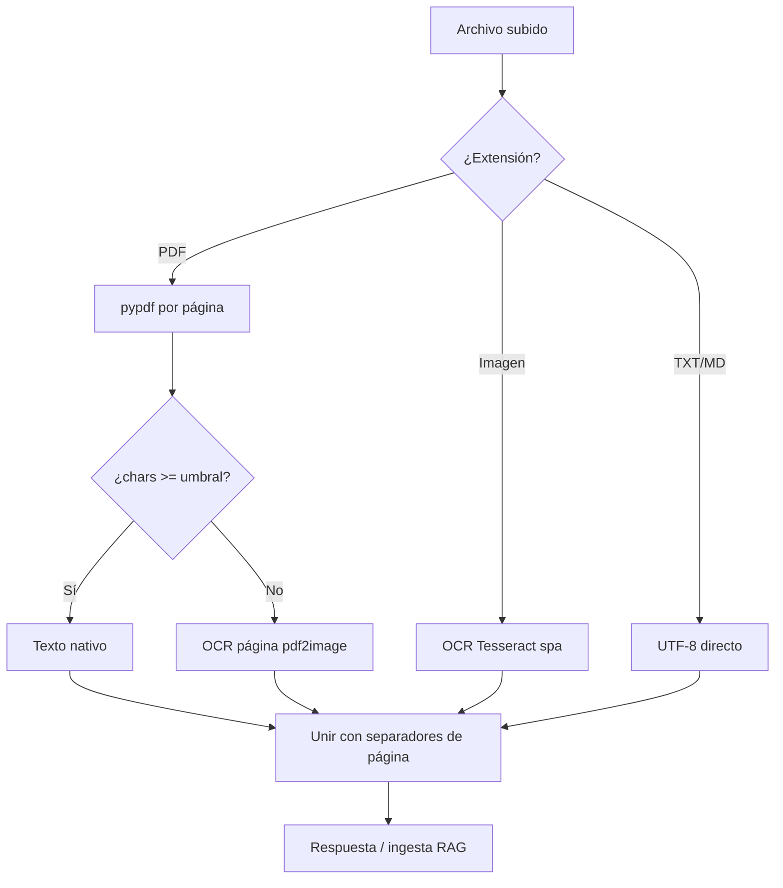

# Sprint 1 — Módulo OCR y extracción de documentos

**Estado:** Implementado  
**Objetivo:** Procesar PDFs escaneados e imágenes, extraer texto completo en español y exponer un endpoint de prueba antes del pipeline de agentes (Sprint 3).

---

## Alcance entregado

| ID | Tarea | Ubicación |
|----|--------|-----------|
| 1.1 | Slice OCR (`DocumentExtractor`) | `app/slices/ocr/` |
| 1.2 | PDF: texto nativo (pypdf) + fallback OCR por página | `app/slices/ocr/extractor.py` |
| 1.3 | Imágenes PNG, JPG, TIFF, WEBP, BMP | mismo módulo |
| 1.4 | Integración con ingesta RAG | `app/slices/rag/extract.py` |
| 1.5 | Endpoint de prueba sin indexar | `POST /api/v1/documents/extract` |
| 1.6 | Metadatos de extracción | `ExtraccionDocumentoResponse` |
| 1.7 | Ejecución CPU-bound en hilo (`asyncio.to_thread`) | `extract.py`, router |

---

## Flujo de extracción



**Métodos reportados:**

| Valor | Significado |
|-------|-------------|
| `nativo` | Solo texto embebido del PDF o archivo de texto |
| `ocr` | Todas las páginas pasaron por Tesseract |
| `hibrido` | Mezcla de páginas nativas y OCR |

---

## Subida masiva

| Endpoint | Descripción |
|----------|-------------|
| `POST /api/v1/rag/ingest-files` | Indexa varios archivos en una colección (OCR + embeddings) |
| `POST /api/v1/documents/extract-files` | Solo extrae texto (metadatos; texto opcional) |

Límites configurables: `BULK_MAX_FILES` (default 50), `BULK_MAX_FILE_BYTES` (50 MiB), `BULK_INGEST_CONCURRENCY` (default 2).

Desde el menú de desarrollo: **opción 11** (ingesta masiva) u **opción 15** (extracción masiva):

```powershell
.\scripts\dev-menu.ps1
```

---

## Endpoint principal

### `POST /api/v1/documents/extract`

**Content-Type:** `multipart/form-data`  
**Campo:** `file` (PDF, TXT, MD, PNG, JPG, …)

**Respuesta (JSON):**

```json
{
  "texto": "...",
  "nombre_archivo": "plan_escaneado.pdf",
  "metodo_extraccion": "ocr",
  "paginas": 12,
  "caracteres": 45230,
  "paginas_ocr": 12,
  "paginas_nativas": 0,
  "confianza_ocr_promedio": 87.3
}
```

En Swagger: grupo **documentos** → *Try it out*.

---

## Variables de entorno (OCR)

| Variable | Default | Descripción |
|----------|---------|-------------|
| `OCR_ENABLED` | `true` | Si `false`, PDF sin capa de texto falla (como antes) |
| `OCR_LANG` | `spa` | Idioma Tesseract |
| `OCR_DPI` | `200` | Resolución al rasterizar PDF (mayor = más lento, mejor calidad) |
| `OCR_MIN_CHARS_PER_PAGE` | `50` | Umbral para decidir OCR en una página |

---

## Pruebas

### Swagger

1. Asegura `GET /health/ready` → `healthy: true`.
2. `POST /documents/extract` con un PDF escaneado o imagen.
3. Verifica `metodo_extraccion`, `caracteres` > 0 y fragmentos `--- Página N ---` en `texto`.

### PowerShell (curl)

```powershell
curl.exe -X POST "http://localhost:8000/api/v1/documents/extract" `
  -F "file=@ruta\al\plan_escaneado.pdf;type=application/pdf"
```

### Ingesta RAG (mismo extractor)

`POST /api/v1/rag/ingest-file` usa el mismo pipeline: un PDF escaneado ya no debería devolver *"PDF sin texto seleccionable"* si OCR está activo.

```powershell
curl.exe -X POST "http://localhost:8000/api/v1/rag/ingest-file" `
  -F "collection_id=plan_demo" `
  -F "file=@ruta\al\plan_escaneado.pdf;type=application/pdf"
```

---

## Dependencias del sistema (Docker)

Incluidas en la imagen `api` (Sprint 0):

- `tesseract-ocr` + `tesseract-ocr-spa`
- `poppler-utils` (para `pdf2image`)

Paquetes Python: `pytesseract`, `pdf2image`, `Pillow` (`requirements.txt`).

### Desarrollo local sin Docker

Instala en el host:

- Windows: [Tesseract](https://github.com/UB-Mannheim/tesseract/wiki) con paquete `spa` + [Poppler](https://github.com/oschwartz10612/poppler-windows/releases).
- Ajusta `PATH` o `TESSDATA_PREFIX` si Tesseract no se detecta.

---

## Rendimiento y límites

- OCR es **CPU-intensivo**; documentos grandes (>100 páginas) pueden tardar varios minutos.
- La API ejecuta la extracción en un **hilo de fondo** para no bloquear el event loop.
- Para demos, prueba primero con PDFs de pocas páginas o reduce `OCR_DPI` a `150`.
- Sprint 2 añadirá chunking dinámico; este sprint solo extrae texto completo.

---

## Errores frecuentes

| Error | Causa | Solución |
|-------|--------|----------|
| `PDF sin texto seleccionable y OCR deshabilitado` | `OCR_ENABLED=false` | Activar OCR en compose / `.env` |
| `tesseract is not installed` | Binario ausente en imagen | Reconstruir: `docker compose build api --no-cache` |
| `Unable to get page count` (poppler) | Falta `pdftoppm` | Verificar `poppler-utils` en Dockerfile |
| Texto OCR con muchos errores | Escaneo bajo contraste | Subir `OCR_DPI` a 300; mejorar escaneo |
| Timeout en Swagger | PDF muy grande | Probar con `curl` y más paciencia, o dividir documento |

---

## Estructura de código

```
app/slices/ocr/
  __init__.py
  extractor.py      # DocumentExtractor, lógica nativo/OCR
  schemas.py        # ExtraccionDocumentoResponse

app/slices/documents/
  router.py         # POST /documents/extract

app/slices/rag/
  extract.py        # Puente async → extractor (ingesta RAG)
```

---

## Criterios de aceptación

- [ ] PDF escaneado devuelve `metodo_extraccion` = `ocr` o `hibrido` y `caracteres` > 1000 (según documento).
- [ ] PDF con texto nativo (Word) devuelve `nativo` sin OCR en todas las páginas.
- [ ] Imagen PNG/JPG devuelve texto legible en español.
- [ ] `POST /rag/ingest-file` indexa un PDF escaneado sin error 400.
- [ ] Separadores `--- Página N ---` presentes en PDF multipágina.

---

## Siguiente paso (Sprint 2–3)

- **Sprint 2:** chunking dinámico (`adaptive`) según tipo de documento y calidad OCR.
- **Sprint 3:** `POST /analysis/analyze-document` — OCR → indexar → agentes + loop coordinador + SSE.

Ver plan general en `PLAN_DESARROLLO.md`.
