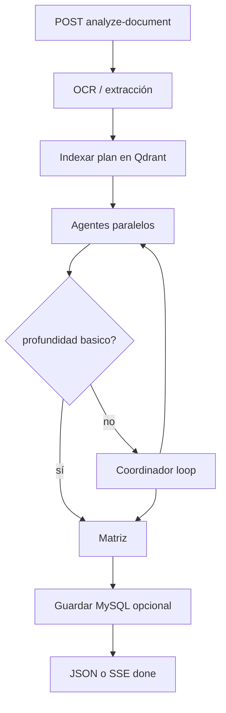

# Sprint 3 — Agentes, loop coordinador y análisis de documento

**Estado:** Implementado  
**Objetivo:** Endpoint único que recibe un plan, aplica OCR, indexa, ejecuta agentes en paralelo, loop del coordinador y opcionalmente persiste en MySQL.

---

## Alcance entregado

| ID | Tarea | Ubicación |
|----|--------|-----------|
| 3.1 | Slice `analysis` | `app/slices/analysis/` |
| 3.2 | Prompts por agente | `data/prompts/*.md` + `prompt_builder.py` |
| 3.3 | Agentes: responsabilidades, leyes, actores, brechas, matriz | `agents.py`, `parsers.py` |
| 3.4 | RAG multi-query por agente | `rag_context.py` |
| 3.5 | Coordinador iterativo | `coordinator.py`, `service.py` |
| 3.6 | Endpoint principal + SSE | `POST /api/v1/analysis/analyze-document` |
| 3.7 | Persistencia MySQL opcional | `persist.py` |

---

## Flujo del pipeline



---

## Endpoint principal

### `POST /api/v1/analysis/analyze-document`

**Content-Type:** `multipart/form-data`

| Campo | Obligatorio | Default | Descripción |
|-------|-------------|---------|-------------|
| `file` | Sí | — | PDF, imagen, TXT, MD |
| `collection_id` | Sí | — | Colección Qdrant del plan |
| `normativa_collection_ids` | No | — | Colecciones extra separadas por coma |
| `nivel` | No | `municipal` | Contexto jurídico en prompts |
| `profundidad` | No | `estandar` | `basico` \| `estandar` \| `profundo` |
| `entidad` | No | `""` | Nombre entidad en prompts |
| `plan_id` | No | UUID nuevo | ID plan MySQL existente o nuevo |
| `titulo_plan` | No | nombre archivo | Título al persistir |
| `guardar_mysql` | No | `true` | Persistir resultados |
| `stream` | No | `false` | `true` → SSE en vivo |

### Respuesta JSON (`stream=false`)

Incluye listas `responsabilidades`, `leyes`, `actores`, `brechas`, `matriz`, metadatos de extracción/indexación y `plan_id`.

### SSE (`stream=true`)

Eventos típicos:

| type | Descripción |
|------|-------------|
| `log` | Mensaje de progreso |
| `indexing_done` | Chunks indexados |
| `agent_start` / `agent_done` / `agent_error` | Por agente |
| `coordinator_decision` | Acción del loop |
| `saving` | Escritura MySQL |
| `heartbeat` | Cada ~20s |
| `done` | Resultado final + `session_id` |
| `error` | Fallo fatal |

---

## Profundidad de análisis

| Valor | Agentes | Coordinador | Matriz |
|-------|---------|-------------|--------|
| `basico` | resp, leyes, actores | No | No |
| `estandar` | resp, leyes, actores | Sí (hasta `ANALYSIS_MAX_ITERATIONS`) | Sí |
| `profundo` | + brechas | Sí | Sí |

---

## Variables de entorno

| Variable | Default | Descripción |
|----------|---------|-------------|
| `ANALYSIS_MAX_ITERATIONS` | `3` | Máximo iteraciones del coordinador |
| `ANALYSIS_CONFIDENCE_THRESHOLD` | `0.55` | Reservado para refinamientos futuros |
| `DEFAULT_CHUNK_STRATEGY` | `adaptive` | Chunking al indexar el plan |
| `MYSQL_URL` | (compose) | Requerido si `guardar_mysql=true` |

---

## Pruebas

### Swagger

Grupo **analisis** → `analyze-document` → subir PDF → `stream=false` para JSON completo.

### Menú desarrollo

```powershell
.\scripts\dev-menu.ps1
```

Opciones **17** (análisis JSON) y **18** (análisis SSE).

### curl (SSE)

```powershell
curl.exe -N -X POST "http://localhost:8000/api/v1/analysis/analyze-document" `
  -F "file=@ruta\plan.pdf" `
  -F "collection_id=plan_demo" `
  -F "normativa_collection_ids=normas_legales" `
  -F "profundidad=estandar" `
  -F "stream=true" `
  -F "guardar_mysql=true"
```

---

## Estructura de código

```
app/slices/analysis/
  router.py
  service.py      # pipeline + SSE
  agents.py
  coordinator.py
  rag_context.py
  parsers.py
  prompt_builder.py
  persist.py
  schemas.py

data/prompts/
  responsabilidades.md
  leyes.md
  actores.md
  brechas.md
  matriz.md
```

---

## Limitaciones conocidas (MVP)

- Sin Redis/replay de sesiones (eventos SSE solo en vivo).
- Parseo de salidas LLM por formato de líneas; respuestas muy libres pueden perder ítems.
- Tiempos largos en CPU con `llama3.1:8b` y PDFs grandes.
- Re-indexar el plan en cada análisis (mismo `document_id` reemplaza chunks).

---

## Criterios de aceptación

- [ ] PDF escaneado analizado con `metodo_extraccion=ocr` o `hibrido`
- [ ] `stream=true` emite eventos hasta `done`
- [ ] `profundidad=estandar` devuelve matriz no vacía (si el modelo responde JSON válido)
- [ ] Con MySQL, `guardar_mysql=true` crea/actualiza plan y tablas hijas
- [ ] `GET /planes/{plan_id}` muestra datos persistidos

---

## Referencias

- [Sprint 1 — OCR](./SPRINT_1.md)
- [Sprint 2 — Chunking](./SPRINT_2.md)
- Plan general: `PLAN_DESARROLLO.md`
